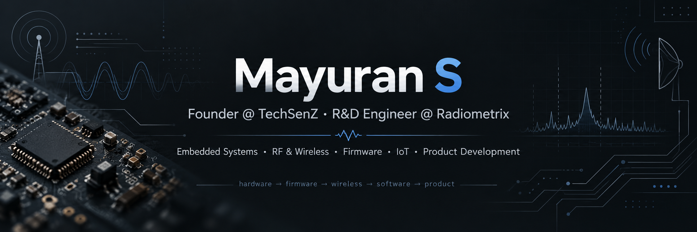

<p align="center">
  
</p>

<div align="center">

# Mayuran S

### Founder @ [TechSenZ](https://techsenz.com) · R&D Engineer @ [Radiometrix](https://Radiometrix.com)

**Embedded Systems · RF & Wireless · Firmware · IoT · Product Development**

I work where hardware, firmware, wireless communication  
and software come together as a complete product.

[TechSenZ](https://techsenz.com) ·
[TechSenZ GitHub](https://github.com/techsenzofficial) ·
[LinkedIn](https://www.linkedin.com/in/mayuran99/)

</div>

---

## About

I am the **Founder of TechSenZ** and an **R&D Engineer at Radiometrix**.

My work spans embedded systems, RF and wireless communication, firmware,
hardware integration, debugging, testing and connected product development.

I enjoy engineering problems where several layers need to work together —
from MCU firmware and RF communication to PCB-level integration,
automation and application software.

---

## Founder @ TechSenZ

I founded **TechSenZ** to build practical technology solutions across
embedded systems, IoT, connected devices and software.

The direction behind TechSenZ is simple:

> **Build complete systems — not isolated pieces of hardware or software.**

Our focus includes:

- Embedded product development
- Firmware
- IoT systems
- Connected devices
- Engineering software
- Prototyping
- Hardware and software integration
- Product development

🌐 [techsenz.com](https://techsenz.com)  
💻 [github.com/techsenzofficial](https://github.com/techsenzofficial)

---

## R&D Engineer @ Radiometrix

My professional engineering work at **Radiometrix** is focused mainly on
embedded and wireless systems.

My work includes areas such as:

- Embedded firmware development
- RF and wireless communication
- MCU peripherals and interfaces
- Communication protocols
- Hardware–firmware integration
- Hardware bring-up
- Debugging
- Test automation
- Product validation
- Engineering documentation

A significant part of this work is maintained in private repositories.

---

## Where I Work Technically

### Embedded

`C` · `C++` · `STM32` · `STM32WL` · `ESP32` · `nRF52`

`UART` · `USART` · `SPI` · `I²C` · `GPIO` · `ADC`

### RF & Wireless

`Sub-GHz RF` · `FHSS` · `BLE`

`Packet Communication` · `Device Pairing` ·  
`Wireless Configuration` · `RF Testing`

### Hardware

`Altium Designer` · `PCB Design` · `MCU Integration`

`Power Architecture` · `Sensor Interfaces` · `RF Hardware`

`Logic Analyzer` · `Oscilloscope` · `ST-LINK`

### Software

`Python` · `TypeScript` · `JavaScript`

`Next.js` · `React` · `Node.js`

I use software as another engineering layer —
for automation, test tools, dashboards, device interfaces and connected products.

---

## From Problem to Product

```text
Problem
   ↓
Requirements
   ↓
System Architecture
   ↓
Hardware + Firmware
   ↓
Prototype
   ↓
Measure
   ↓
Debug
   ↓
Fix the Root Cause
   ↓
Test
   ↓
Validate
   ↓
Refine
   ↓
Product
